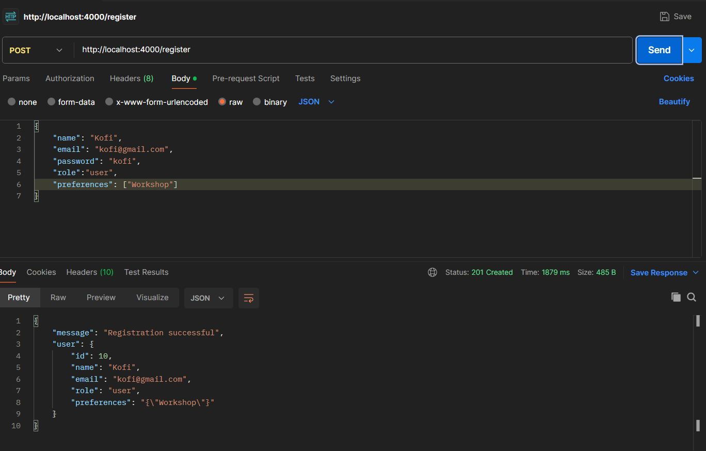
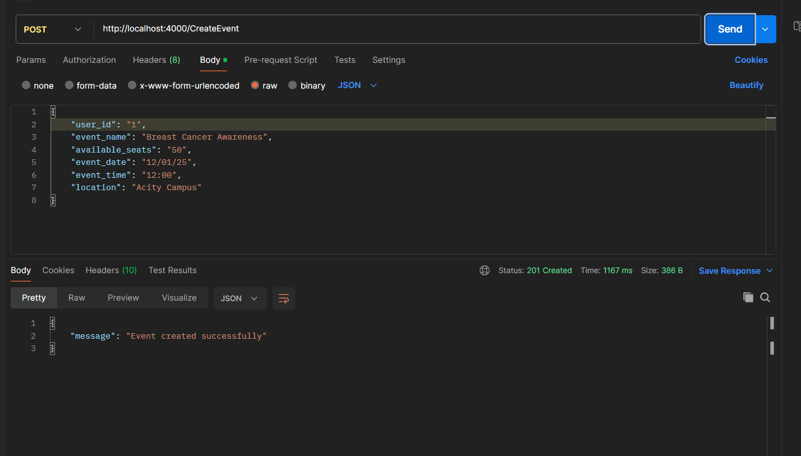

# CampusConnect - Campus Event Management System

## Project Overview
CampusConnect is a versatile platform for managing campus events with ease. It includes features like event scheduling, RSVP, event creation and real-time updates, ensuring seamless organization and participation. From club meetings to cultural festivals, CampusConnect simplifies event management and enhances campus engagement.


##Frontend Repository On Github
- **Frontend Repository**: [https://github.com/AdzeyenaOpei/Frontend](https://github.com/AdzeyenaOpei/Frontend)

## Deployment Links
- **Frontend Application**: [https://frontend-xi-blush-60.vercel.app/](https://frontend-xi-blush-60.vercel.app/)
- **Supabase Backend**: [https://backend-rux4.onrender.com](https://backend-rux4.onrender.com)

## Test Login Credentials
```
## Admin
Email: Kobina@example.com
Password: kobina
```
## User
Email: Arnold@example.com
Password: arnold
```

## Feature Checklist
### User Authentication
  - [x] Login/Register functionality
  - [x] Remember Me option
  - [x] Password recovery

### Event Management
  - [x] Create new events
  - [x] Edit existing events
  - [x] Delete events
  - [x] View event details

### Ticket System
  - [x] Book tickets
  - [x] Generate QR codes
  - [x] View booking history
  - [x] Cancel bookings

### Admin Features
  - [x] Event approval system
  - [x] User management
  - [x] Analytics dashboard

## Installation Instructions

### Prerequisites
- Node.js (v14 or higher)
- npm
- Git

### API Testing Screenshots



### Event Management Endpoints


### User Management Endpoints


## Installation Instructions
- Git
- Node.js
- Supabase

### Local Setup
1. Clone the repository
```bash
git clone [repository-url]
cd EventoEMS
```

2. Install dependencies
```bash
cd client
npm install
```

3. Configure environment variables
Create a `.env` file in the client directory:
```env
VITE_SUPABASE_URL=your-supabase-project-url
VITE_SUPABASE_ANON_KEY=your-supabase-anon-key
```

4. Start the development server
```bash
npm run dev
```

The application will be available at `http://localhost:5173`

## API Documentation

### Authentication Endpoints


#### POST /auth/login
- Request:
```json
{
  "email": "kobina@example.com",
  "password": "kobina"
}
```
- Response:
```json
{
  "user": {
    "id": "123",
    "email": "user@example.com",
    "name": "John Doe"
  },
  "token": "jwt-token"
}
```

### Event Endpoints


#### GET /events
- Response:
```json
{
  "events": [
    {
      "id": "1",
      "title": "Campus Festival",
      "date": "2024-03-15",
      "location": "Main Hall"
    }
  ]
}
```

### Ticket Endpoints


#### POST /tickets/book
- Request:
```json
{
  "eventId": "1",
  "userId": "123",
  "quantity": 2
}
```
- Response:
```json
{
  "ticketId": "t123",
  "qrCode": "base64-encoded-qr",
  "status": "confirmed"
}
```

## Technology Stack
- Frontend: React.js with Vite
- Backend: Supabase
- Database: PostgreSQL (Supabase)
- Styling: Tailwind CSS
- Authentication: Supabase Auth
- Deployment: Vercel (Frontend)


---